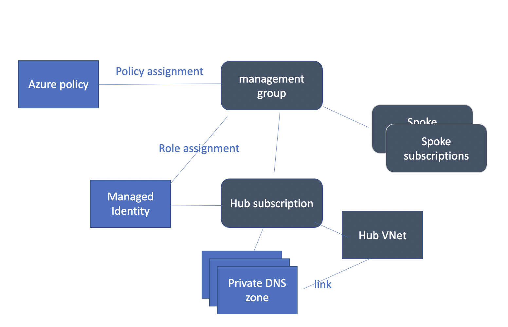

This repo demostrate how to manage Azure private DNS zone along with Azure Policy to manage private endpoint DNS configuration.

Basically what we do here are:
1. Create resource group for DNS resources
2. Create Managed Identity and assign "Network Contributor" role in management group
3. Create Private DNS zone and assign azure policy to update DNS configuration of private endpoint.

# notes
1. The DNS config update may take some time (~30 mins) due to Azure policy scan frequency.